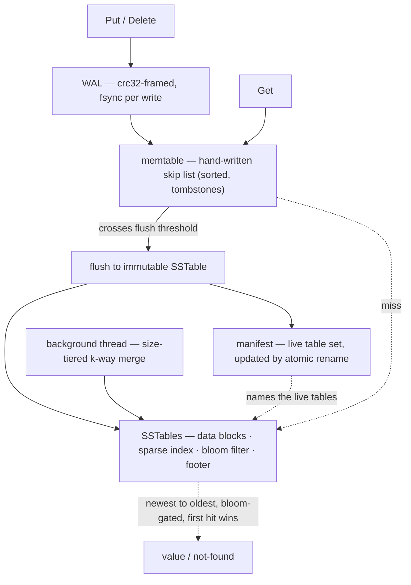
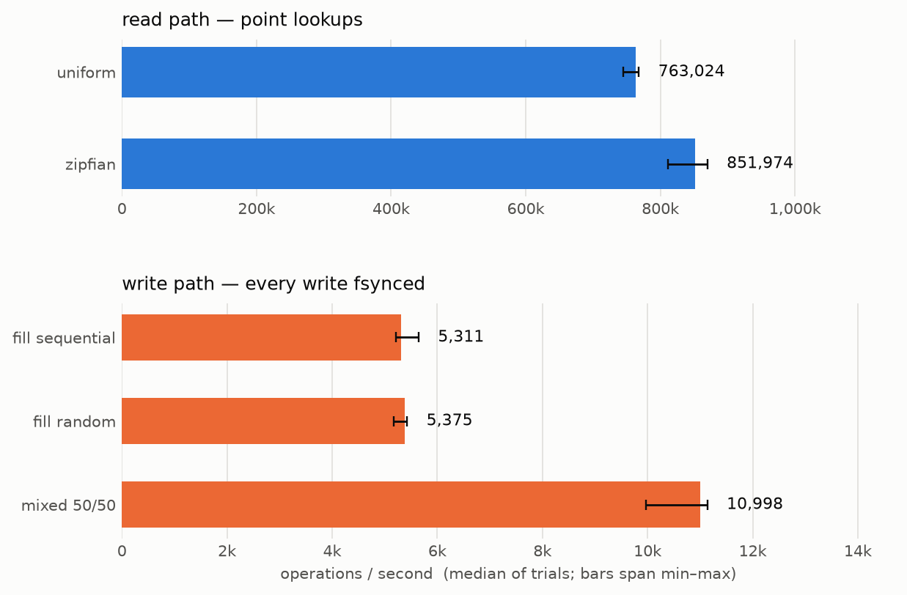
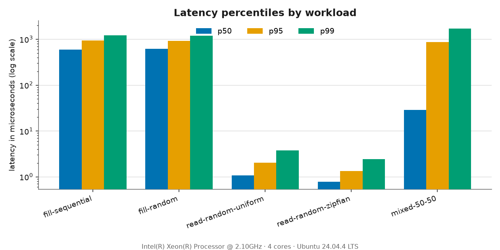
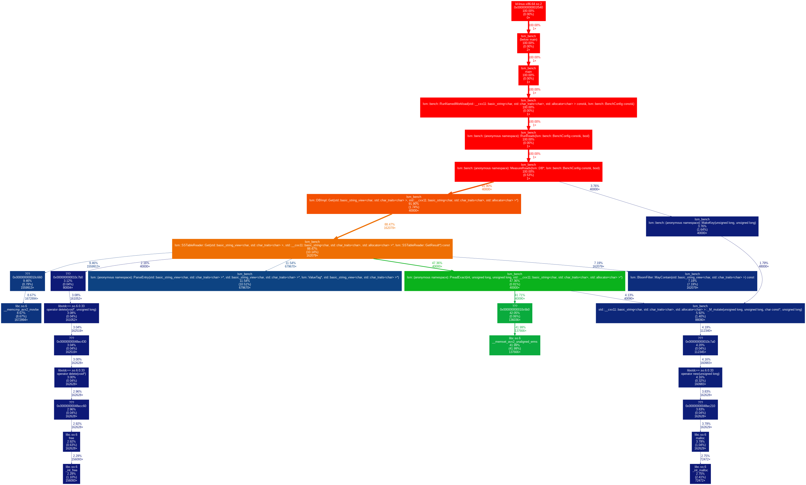
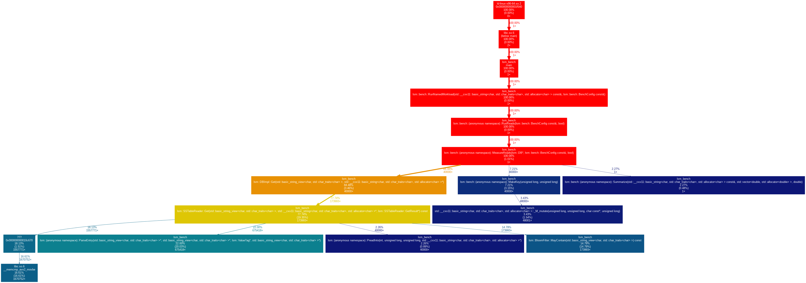

# lsm-storage-engine

[](https://github.com/aayushhks/lsm-storage-engine/actions/workflows/ci.yml)

A single-node, log-structured merge-tree key-value store written from scratch in
C++20 — a write-ahead log with crash recovery, immutable SSTables with a sparse
index, per-table bloom filters, and size-tiered background compaction. The engine
depends on the standard library only (CRC32 and the bloom hashing are
hand-rolled); it is tested under Address/UB/Thread sanitizers, benchmarked, and
profiled. It is not a RocksDB competitor — it is a from-scratch engine built to
understand and defend every layer, benchmarked honestly on stated hardware.

Every design decision and its tradeoff is written up in
[`docs/design.md`](docs/design.md).

## architecture



- **Writes** append a CRC32-framed record to the WAL and `fsync` it *before*
  touching the in-memory skip-list memtable, so a crash never loses an
  acknowledged write.
- **Flush**: when the memtable crosses its size threshold it is written out as an
  immutable SSTable (sorted data blocks + a sparse one-entry-per-block index + a
  bloom filter + a fixed footer); the manifest is updated by atomic rename, then
  the WAL is rotated away.
- **Reads** consult the memtable, then the SSTables newest-to-oldest, stopping at
  the first hit or tombstone; each table's bloom filter lets a lookup skip tables
  that cannot hold the key.
- **Compaction** runs on one background thread: when similarly sized tables
  accumulate it k-way-merges them, dropping shadowed values and safe tombstones.

## highlights

- **Durability with crash recovery** — WAL replay on open; a torn or corrupt tail
  record is detected by CRC and truncated, so recovery never fails on a bad tail.
- **Hand-written skip-list memtable** — ordered, tombstone-aware, with memory
  accounting for the flush threshold.
- **From-scratch SSTable format** — sparse index + bloom filter; point lookups are
  a binary search on the index plus one `pread`.
- **From-scratch bloom filter** — bit array + k probes via double hashing;
  false-positive rate is a build parameter (measured 1.08% at the 1% target).
- **Lock-free-read concurrency** — compaction never blocks or breaks a reader
  (immutable, reference-counted table-set snapshot); verified under ThreadSanitizer.
- **Benchmarked and profiled** — reproducible workloads, committed numbers, and a
  real read-path optimization found by profiling (−48% instructions, +19% reads).
- **Green CI** — every push builds on gcc + clang (Debug/Release), runs the suite
  under ASan/UBSan and TSan, and checks clang-tidy and clang-format.

## build and test

Requires CMake 3.20+, a C++20 compiler (gcc 13 / clang 18), and Ninja.

```sh
cmake -S . -B build -G Ninja
cmake --build build
ctest --test-dir build --output-on-failure

# release
cmake -S . -B build-release -G Ninja -DCMAKE_BUILD_TYPE=Release
cmake --build build-release

# sanitizers
cmake -S . -B build-asan  -G Ninja -DLSM_SANITIZE=asan-ubsan && ctest --test-dir build-asan
cmake -S . -B build-tsan  -G Ninja -DLSM_SANITIZE=tsan       && ctest --test-dir build-tsan
```

## usage

```cpp
#include "lsm/db.h"

lsm::Options options;
std::unique_ptr<lsm::DB> db;
lsm::Status s = lsm::DB::Open(options, "/path/to/db", &db);

db->Put("key", "value");

std::string value;
if (db->Get("key", &value).ok()) {
  // found
}

db->Delete("key");
db->Close();  // also happens on destruction
```

Keys and values are arbitrary byte strings (embedded nul bytes are fine). Every
fallible call returns a `Status`; a missing key is `Status::NotFound`.

## benchmarks

Numbers from a single run of the `bench` harness — no cherry-picking; the raw JSON
is committed at [`bench/results/results.json`](bench/results/results.json) and the
charts are regenerated from it by `bench/plot_results.py`.

Hardware: **Intel Xeon @ 2.10 GHz, 4 cores, 16 GB RAM, Ubuntu 24.04 (ext4)**.
Config: 50,000 ops per workload, 100,000-key read set, 16-byte keys, 100-byte
values, 4 MiB flush threshold.

| workload | ops/sec | p50 (µs) | p95 (µs) | p99 (µs) |
|---|---:|---:|---:|---:|
| fill-sequential | 1,556 | 595.57 | 937.54 | 1227.50 |
| fill-random | 1,533 | 614.08 | 929.50 | 1190.85 |
| read-random-uniform | 738,001 | 1.08 | 2.05 | 3.80 |
| read-random-zipfian | 935,160 | 0.78 | 1.32 | 2.46 |
| mixed-50-50 | 2,897 | 28.61 | 864.14 | 1726.27 |




Reads run at hundreds of thousands of ops/sec with roughly single-microsecond p50
(memtable or one bloom-filtered `pread`). Writes are **fsync-bound** at ~1.5k
ops/sec — every write flushes to disk before returning, so p50 is essentially one
`fsync`. Group commit (a listed next step) is the known remedy.

```sh
./build-release/bench/lsm_bench --out=bench/results/results.json
python3 bench/plot_results.py bench/results/results.json
```

### profiling story

Profiling the read path (valgrind/callgrind — this container has no `perf`; the
perf recipe is in [`bench/profiling/`](bench/profiling/README.md)) found one
dominant hotspot: `SSTableReader::Get` allocated a fresh block buffer per lookup
and `resize()` zero-filled ~4 KiB that `pread` then immediately overwrote — **42%
of read-loop instructions spent on a `memset` that was thrown away**, plus ~6% in
per-lookup `malloc`/`free`.

The fix was a reused `thread_local` block buffer and a `PreadInto` that skips the
zero-fill. Measured, same machine, before vs. after:

- **instructions: read loop 394.5M → 205.7M (−48%)** — the memset vanishes.
- **throughput (sstable-backed read-random): median ~896k → ~1.07M ops/sec (+19%)**,
  with far less run-to-run jitter, and p99 ~1.7µs → ~1.3µs.

| before | after |
|---|---|
|  |  |

The bright-green `memset` branch on the left is gone on the right; the remaining
read cost is genuine work — key comparison, block parsing, bloom probing.

## design decisions & tradeoffs

The reasoning behind each is in [`docs/design.md`](docs/design.md); in brief:

- **A `Status` type, not exceptions or `optional`.** A storage engine's failures —
  a short read, a bad CRC — are expected control flow; one uniform `Status` across
  the API keeps every failure path visible.
- **A skip list for the memtable, over a balanced tree.** No rotations to get
  right, and inserts touch only the search path — the property that makes
  lock-free single-writer/multi-reader possible and the reason it is the industry
  default.
- **fsync-per-write durability.** The strongest, simplest guarantee; the tradeoff
  is throughput, which the benchmark quantifies and group commit would recover.
- **Atomic manifest via write-temp + rename.** `rename` is atomic on POSIX, so a
  torn manifest is unrepresentable and no checksum is needed; the manifest commit
  is the single durability point for a flush or compaction.
- **Immutable, reference-counted table-set snapshot for reads.** A read copies a
  snapshot pointer under a brief lock then reads lock-free; a concurrent
  compaction swaps in a new snapshot and can even delete the old files without
  breaking an in-flight read (POSIX keeps the inode alive behind the open fd).
  Chosen over a `shared_mutex`, under which reads would hold a lock across their
  I/O.
- **Size-tiered compaction, over leveled.** Lower write amplification
  (~O(log_F N)) and far simpler to implement correctly; it accepts higher
  transient space amplification, which is the right tradeoff at single-node scope.
- **A bloom filter per SSTable.** Converts a miss from one block read per table
  into ~`fpr` block reads per table; the FPR is a build parameter.

## limitations

Honest scope, stated plainly:

- **Single node** — no distribution, replication, or sharding.
- **Single writer** — writes are serialized under a mutex; reads are concurrent.
- **Point lookups only** — no range scans / iterators (a stretch goal not reached).
- **No transactions, MVCC, or snapshot reads.**
- **No compression.**
- **Size-tiered compaction only** — no leveled compaction.
- **Synchronous flush** — a flush runs under the write lock; a large flush briefly
  stalls writers (an immutable-memtable async flush is the fix).
- **Orphaned SSTables leak** — a table written by a compaction/flush that crashed
  before its manifest commit is correctly ignored on restart but not deleted.

## what I'd build next

Understood but deliberately descoped, roughly in priority order:

- **Group commit** — batch the records from many concurrent writers into a single
  `write` + `fsync`, amortizing the flush across the batch; this is the measured
  write-path bottleneck.
- **Range scans** — a merge iterator across the memtable and SSTables with correct
  shadowing; the per-table ordered scan iterator already exists (compaction uses
  it), so this is mostly a k-way merge with tombstone handling exposed as an API.
- **Leveled compaction** — one sorted run per level with non-overlapping key
  ranges, trading write amplification for much lower space amplification when disk
  is tight.
- **Snapshot reads / MVCC** — tag keys with a sequence number so a reader pins a
  consistent version, formalizing the internal immutable-snapshot mechanism into a
  user-visible snapshot.
- **Async flush** — freeze the full memtable and flush it on a background thread so
  writes never stall under the lock during a flush.
- **Orphan reclamation** — delete on-disk tables the manifest does not name, at
  startup.

## how it was built

Built milestone by milestone, each finished green (warnings-as-errors, clang-tidy,
clang-format, all tests under sanitizers) before the next:

`m1` skeleton · `m2` skip-list memtable · `m3` WAL + recovery · `m4` SSTable flush
+ manifest · `m5` read path + bloom filters · `m6` background compaction · `m7`
benchmark harness · `m8` profiling pass · `m9` README + framing.
